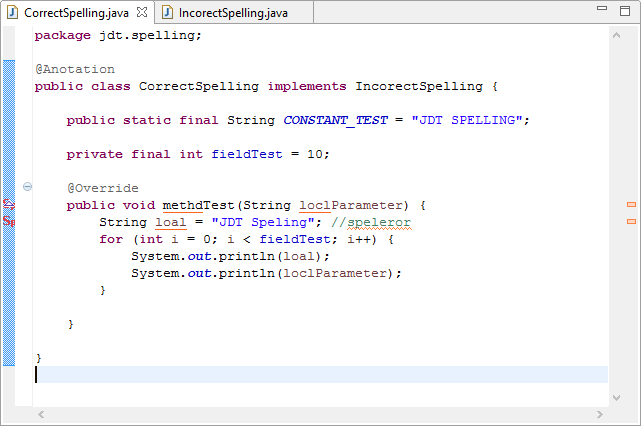

jdt.spelling
============

Spelling for Java names using JDT.

The aim is to provide spelling support for words contained in the names of Java artefacts: Interfaces, Classes, Methods, ...
Splitting out the names using regular naming patters for Java names, that is usually `CamelCase` for types and variables, `UNDERSCORE_SEPARATED` for constants and `dot.separated` for package names.

This relies heavily on org.eclipse.jdt, and currently uses internal components.

## Screenshots and Usage

Click on the word and press <kbd>Ctrl+1</kbd> (quick fix)

You can add words to User or Ignored dictionaries which are stored in the workspace or in files specified in the preferences. Ignored words are not used for suggestions.

Local variables can also be checked, select in preferences

## Continuous Integration

 Master branch 

 Dev branch

## Installing

<table style="border: none; width:100%">
  <tbody>
    <tr style="border:none;">
      <td style="vertical-align: middle; padding-top: 10px; border: none;">
        
      </td>
      <td style="vertical-align: middle; text-align: left; border: none;">
        Drag it onto your Eclipse Main Toolbar to install!</td>
    </tr>
  </tbody>
</table>

or use `http://jdt.spelling.s3-website-us-east-1.amazonaws.com` in Help -> Install New Software ... Dialog.

## Copyright

Copyright (c) 2013-2014 Stuart Hendren.

## License

Licensed under the [EPL License](http://www.eclipse.org/legal/epl-v10.html).

