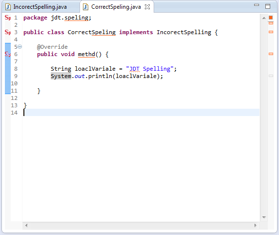
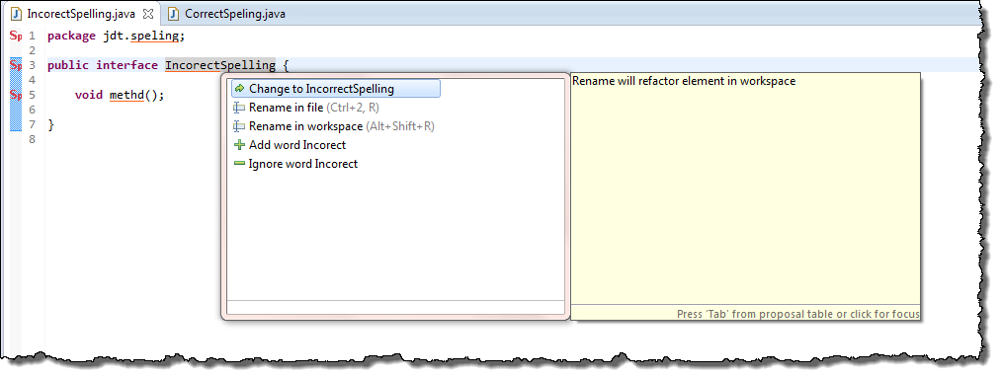

jdt.spelling
============

Spelling for Java names using JDT.

The aim is to provide spelling support for words contained in the names of Java artifacts: Interfaces, Classes, Methods, ...
Splitting out the names using regular naming patters for Java names.

This relies heavily on org.eclipse.jdt, and currently uses internal components.

## Screenshots

## Continuous Integration

CI provided by [Travis CI](http://travis-ci.org/)

## Eclipse update site

[http://stuarthendren.net/update](http://stuarthendren.net/update)

## Copyright

Copyright (c) 2013-2014 Stuart Hendren. 

## License

Licensed under the [EPL License](http://www.eclipse.org/legal/epl-v10.html).

